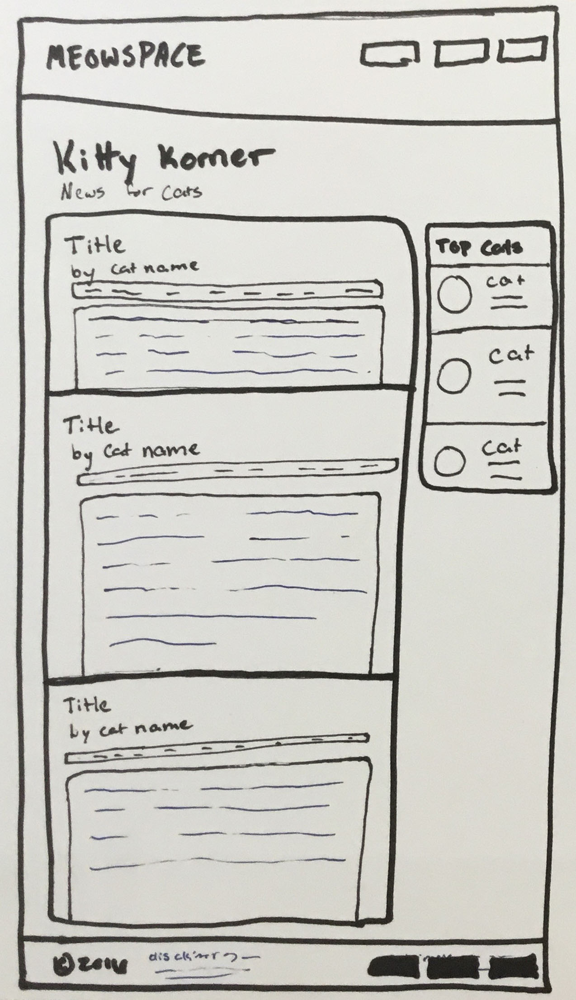

# Meowspace
### Layout Practice!

## Instructions

Use the drawings below to make the provided html code match the layouts. These drawings are called wireframes, they are like a blueprint for your site's layout design. It highlights the layout without focusing on any of the design specifics (like color, fonts etc.).

First, use CSS to rearrange the layout to match the drawings as much as possible (it doesn't need to be perfect).  Only then can you jazz up the site's design with more pleasing colors, fonts and small touches.

- You can make changes to the html
  - WITHOUT moving any content around
  - You can add sectioning elements, ID's and classes and necessary

## Wave 1
### The Homepage

## Wave 2
### Articles

## Wave 3
### Profiles

## Wave 4
### Refactor

Look over your CSS and identify any sets of declarations that are being used a lot. Refactor you CSS to be more dry by utilizing multiple selectors or creating a class.
